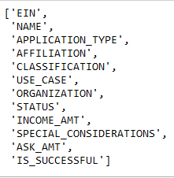
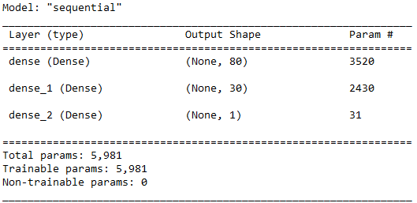

# Neural Network Charity Analysis
Neural Networks and Deep Learning Models

### Overview
Using Tensorflow in Jupyter Notebook, "the Team" delved into deep machine learning models to predict success for charity campaigns submitted to
the orginization Alphabet Soup Charity.

### Results
#### Data Preprocessing

Figure 1.) Features Given from .CSV File

* The target variable in the provided data set is "IS_SUCCESSFUL".
* Initial feature variables include: "APPLICATION_TYPE", "AFFILIATION", "CLASSIFICATION", "USE_CASE", "ORGANIZATION", "STATUS", "INCOME_AMT", "SPECIAL_CONSIDERATIONS" and "ASK_AMT".
* Cursory visual analysis revealed that "EIN" and "NAME" would play no role in modeling, hence were dropped.

#### Compiling, Training, and Evaluating the Model

Figure 2.) Initial Deep Neural Net Parameters

